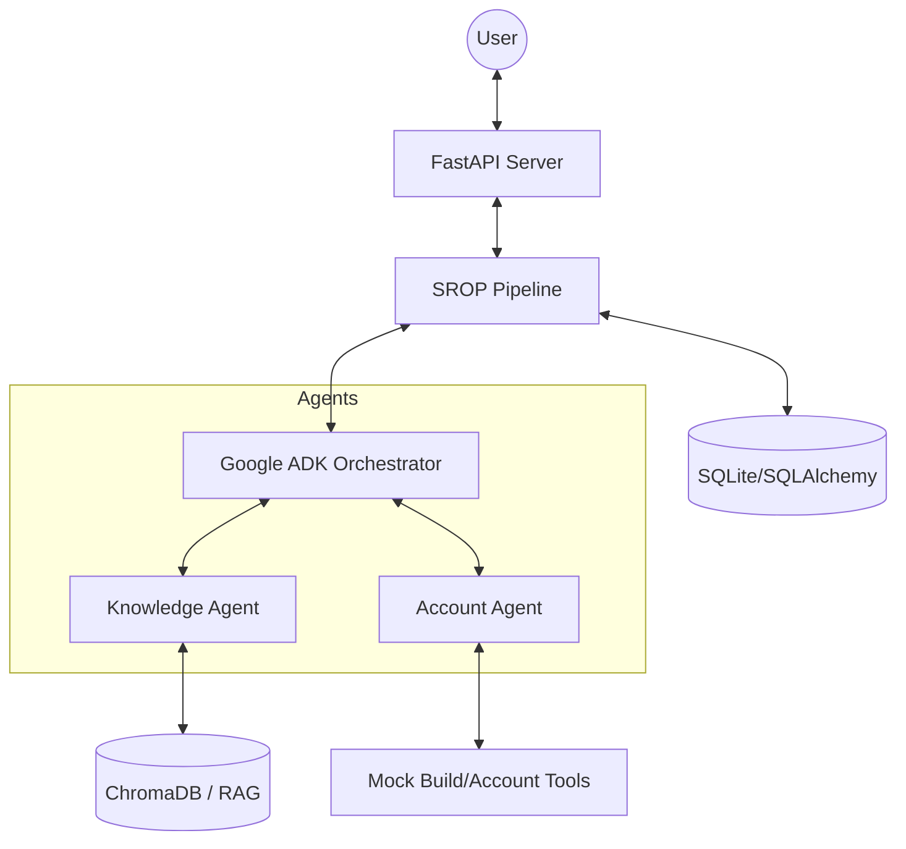

# Helix SROP: AI Support Concierge

This is a Stateful RAG Orchestration Pipeline (SROP) for the Helix support team.

## Architecture



The system consists of:
1. **FastAPI Web Server**: Provides endpoints for sessions, chat, and tracing.
2. **SQLAlchemy (Async)**: Manages persistence for users, sessions, messages, and traces in SQLite.
3. **ChromaDB**: Stores document embeddings for RAG.
4. **Google ADK**: Orchestrates the conversation using a root agent and two specialized sub-agents.
5. **SROP Pipeline**: Manages the state flow, LLM orchestration, and tracing for each turn.

## Design Decisions

### State Persistence: Pattern 3 (System Prompt Injection)
I chose to persist `SessionState` (user_id, plan_tier, turn_count, last_agent) in the database and inject it into the agent's system instruction on every turn. 
- **Reasoning**: This pattern was chosen for its reliability and simplicity. By storing the state in a structured format in the DB, it perfectly survives process restarts (demonstrated in the demo). Injecting it as system context ensures the agent always has the "ground truth" without relying on the LLM's memory or complex session re-hydration logic.

### Chunking Strategy: Heading-Aware
I implemented heading-aware chunking for the markdown docs in `app/rag/ingest.py`.
- **Justification**: Markdown documents are naturally structured by headings. Splitting at these boundaries preserves the semantic context of sections. For very large sections, I fall back to character-based splitting with overlap, ensuring no context is lost at the boundaries.

## Known Limitations
- **Mock Data**: The `AccountAgent` currently uses mock tools for build and account status.
- **State Scope**: While structured state is persisted, the raw message history is not currently re-injected into the ADK context window (only the current turn context is managed).
- **Citations**: Citations are generated by the LLM based on system instructions; more rigorous post-processing could be added.

## Setup & Running (<5 min)

1. **Install Dependencies**:
   ```bash
   pip install fastapi uvicorn pydantic pydantic-settings sqlalchemy aiosqlite chromadb structlog google-adk google-generativeai
   ```

2. **Configure Environment**:
   Add your `GOOGLE_API_KEY` to the `.env` file.

3. **Ingest Documentation**:
   ```bash
   python -m app.rag.ingest --path docs/
   ```

4. **Run the Server**:
   ```bash
   uvicorn app.main:app --reload
   ```

5. **Run Tests**:
   ```bash
   pytest -q
   ```

## Time Spent
- **Env & Boilerplate**: 30 min
- **RAG Ingest & Search**: 45 min
- **ADK Agent Orchestration**: 45 min
- **Pipeline & State Logic**: 60 min
- **API & Tracing**: 30 min
- **Testing & Documentation**: 30 min
- **Total**: ~4 hours
